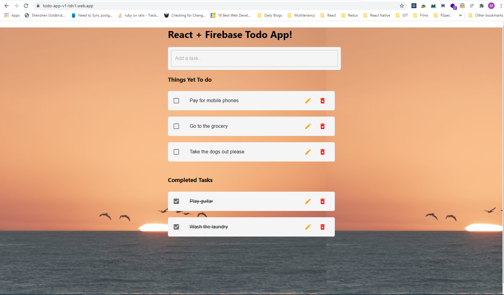

# Todo-React-Firebase-V1
To-do list, implemented in React + Firebase (as a DB)

Author : Merdan Durdyýew  
Github : https://github.com/eminarium  
Medium (Personal blog) : https://merdan-durdiyev.medium.com/  
Medium (Publication / Turkmen content) : https://medium.com/kodeser  
Medium (Publication / English content) : https://medium.com/kode-art  
Dev.to : https://dev.to/eminarium  
Date : 13.12.2020  

Try the live app : https://todo-app-v1-tdv1.web.app/  
  
Beýany: "Todo list" - React framework kömegi bilen, we Firebase maglumat  
ammary bilen ýazylan ýumuşlar priloženiýasy    
Programmany bezemek üçin "Material UI" taýýar elementleri ulanylan.  
Ulanylan esbaplar aşakda görkezilen.  
  
Description : "Todo list" - an application developed with React.js framework and  
Firebase platform from Google. Firebase firestore is used as a DB.  
Material UI package is used for all the decorations within the app.  
List of extra tools used are shown below.  
  
    
Framework: React.js  
Database: Firebase firestore  
Image services: Unsplash  

Extra packages used:  
- Material UI (for decoration)  

Screenshot:

